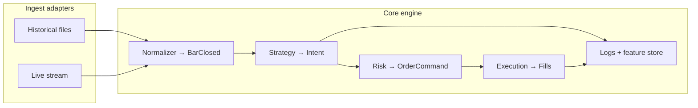

# System architecture

This document describes the **design patterns** behind a production quantitative
trading platform. The demo repo implements a minimal version of each layer using
synthetic data and a placeholder strategy.

---

## Goals

| Goal | How |
|------|-----|
| Backtest/live parity | Same domain events and reducers; only adapters differ |
| Testable core | Strategy and risk are pure; no broker I/O in domain logic |
| Swappable models | `ModelLayer` protocol — rule engine or trained classifier |
| Auditability | Typed events, versioned ML artifacts, structured deny reasons |
| Low operational cost | Single process, file-based storage until scale is proven |

---

## Core idea: one event spine, multiple adapters



- **Backtest:** a `BarFeed` replays `BarClosed` events in time order.
- **Live:** a stream adapter emits the same `BarClosed` types (plus reconnect semantics).

The strategy module is **not** rewritten for production.

---

## Runner (orchestration shell)

`runner/pipeline_runner.py` is the **single loop** that wires modular components:

1. `BarFeed` emits `BarClosed`
2. `Strategy.on_bar()` → `StrategyIntent`
3. `risk.evaluate()` → `OrderCommand` or deny
4. `SimBroker` (or live IBKR adapter) → `FillLeg` / `OrderDone`
5. `state_reducers` project `TradingState` (including bracket state machine)
6. `reconciliation` monitors position drift and rolling SL ratio

`runner/strategy_factory.py` builds the strategy plug-in from `RunnerConfig`.
Live production replaces only step 4.

See [state-machines.md](state-machines.md) for the `PositionGroup` lifecycle.

---

1. **Domain** (no I/O): events, position model, risk rules, feature contracts.
2. **Application**: run loop, session policy, state reducers, correlation IDs.
3. **Infrastructure**: broker client, parquet I/O, configuration, secrets.

**Rule:** strategy and risk decisions must be testable without a broker.

---

## Event model

| Event | Role |
|-------|------|
| `BarClosed` | Primary driver; one closed bar per timeframe |
| `SessionBoundary` | Session open/close markers |
| `StrategyIntent` | Strategy output — **not** a broker order |
| `OrderCommand` | Risk-approved instruction to execution |
| `FillLeg` | One fill leg; idempotent on `fill_id` |
| `OrderDone` | Terminal order state |

Events are immutable dataclasses with a `schema_version` field for forward-compatible persistence.

---

## Market state vs trading state

| Container | Updated by | Purpose |
|-----------|------------|---------|
| `MarketState` | Feed + calendar | Rolling bars, session flags — strategy **reads** |
| `TradingState` | Risk + execution | Open orders, position, risk counters — **authoritative** |

Splitting these keeps strategy logic from mutating broker state directly.

---

## ML pipeline boundaries

Three hand-off points enforce separation of concerns:

```
FactorPipeline → FeatureRow → ModelLayer → Prediction → TradeConstructor → TradeSpec
```

| Type | Contains | Must not contain |
|------|----------|------------------|
| `FeatureRow` | Normalised features at decision time | Future prices, labels |
| `Prediction` | Direction + confidence | Entry, SL, TP prices |
| `TradeSpec` | Complete trade description | Mutable broker state |

**Why split prediction from trade construction?**

- The model answers: *should we trade, and with what confidence?*
- The constructor answers: *where are entry, SL, and TP?* using structural rules.

This lets you swap a rule engine for LightGBM without touching risk or execution.

---

## Risk engine

Only the risk engine may emit `OrderCommand`.

```
StrategyIntent + TradingState + RiskConfig → Allow(OrderCommand) | Deny(reason)
```

Typical rules (evaluated in order):

1. Kill switch
2. Max position
3. Max open orders
4. Daily loss limit
5. Per-bar order rate cap

Denials carry structured reason codes for logging and post-mortems.

---

## Backtest design

- Strategy sees bars only up to the current timestamp (no lookahead).
- Fill simulation may scan forward bars **after** the intent — that is execution modeling, not strategy leakage.
- `FeatureLogger` emits one `FeatureRow` per bar regardless of signal — training data for offline ML.

---

## Production extensions (not in this demo)

The private production system adds:

- IBKR TWS integration (bar stream, bracket orders, reconciliation)
- Multi-timeframe bar aggregation
- CME session calendar and close-buffer flatten
- Golden parity tests between replay and live
- Versioned model registry with walk-forward backtest

This demo implements the **same layer contracts** with simulated execution.

---

## Design principles for interviews

1. **Events over callbacks** — replay, audit, and test from a log.
2. **Protocols over inheritance** — `Strategy` and `ModelLayer` are plug-in contracts.
3. **Pure reducers** — risk and state updates are deterministic given inputs.
4. **Config-driven ML** — one JSON describes an entire training run.
5. **Temporal discipline** — train/val/test splits by date, never random shuffle on time series.
