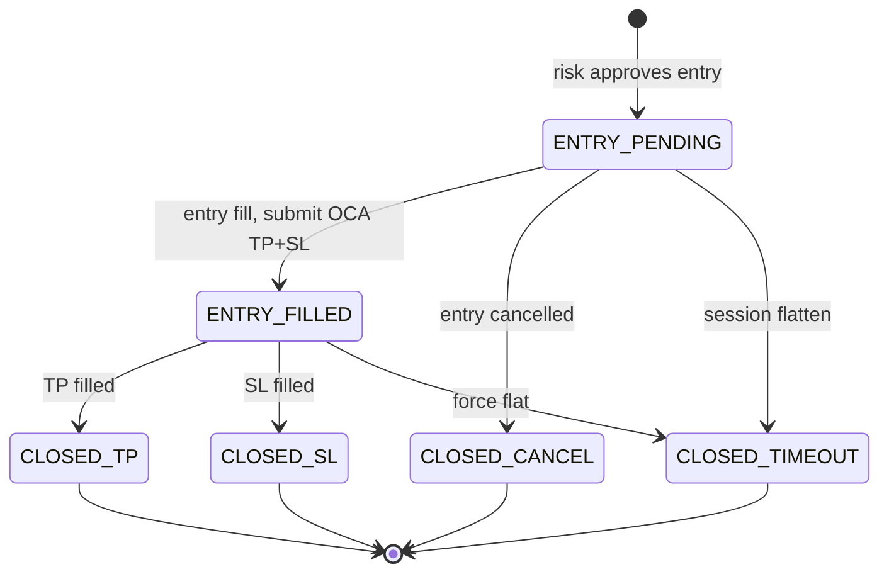

# Architecture

Design of an event-driven quantitative trading platform. The demo implements each
layer with synthetic data and placeholder strategies; the layer contracts match
the production system.

---

## Pipeline

```
┌─────────────┐    ┌─────────────────┐    ┌───────────┐    ┌───────────────────┐
│  Live data  │───▶│ Feature builder │───▶│ ML layer  │───▶│ Trade construction│
│  (or replay)│    │                 │    │           │    │                   │
└─────────────┘    └─────────────────┘    └───────────┘    └─────────┬─────────┘
                                                                       │
     ┌─────────────────────────────────────────────────────────────────┘
     ▼
┌─────────────┐    ┌─────────────┐    ┌──────────────────────────────────────────┐
│ Risk engine │───▶│  Execution  │───▶│ State projection + reconciliation      │
│             │    │  (sim/live) │    │ (bracket state machine, broker-wins)   │
└─────────────┘    └─────────────┘    └──────────────────────────────────────────┘
```

| Stage | Module | Output |
|-------|--------|--------|
| Live data | `engine/bar_feed.py`, live stream adapter | `BarClosed` |
| Feature builder | strategy / factor pipeline | `FeatureRow` |
| ML layer | `engine/model_layer.py` | `Prediction` (direction + confidence) |
| Trade construction | `engine/trade_constructor.py` | `TradeSpec` (entry, SL, TP, size) |
| Risk engine | `risk.py` | `OrderCommand` or deny |
| Execution | `execution/sim_broker.py` | `FillLeg`, `OrderDone` |
| State + reconcile | `runner/state_reducers.py`, `runner/reconciliation.py` | `TradingState` |

The **runner** (`runner/pipeline_runner.py`) is the shell that wires these stages
in a single event loop. Live production swaps the execution adapter; everything
upstream stays the same.

---

## Design decisions

### Why decouple the ML layer from trade construction

The ML layer answers one question: *is this a good entry, and with what
confidence?* It emits a `Prediction` — direction and a score — and nothing else.

Trade construction answers a different question: *given an entry decision, what are
the prices and size?* It produces a `TradeSpec` — entry, stop-loss, take-profit,
contract count — using structural rules (magnet levels, fixed point offsets,
session risk budget). These rules are domain knowledge that should not be
re-learned on every model retrain.

```
FeatureRow → ModelLayer → Prediction → TradeConstructor → TradeSpec → Risk → Execution
              "trade?"     direction      "where & how much?"   prices/size
                           + confidence
```

**What this buys you:**

- Swap LightGBM for a rule engine without touching SL/TP logic or execution.
- Retrain on new features without risking accidental changes to position sizing.
- Test the model (classification metrics) and the trade structure (PnL simulation)
  independently.
- Keep labels clean: `target_*` columns describe outcomes; the model never sees
  prices it shouldn't know at decision time.

### Why immutable domain events

Every fact in the system — bar close, strategy intent, risk-approved order, fill,
terminal order state — is an immutable dataclass appended to the event spine.

**Why:**

- **Replay:** rebuild `TradingState` from the log after a crash or for regression tests.
- **Audit:** answer "why did we send this order?" from typed facts, not unstructured logs.
- **Parity:** backtest and live run the same reducer code against the same event types.
- **No hidden mutation:** strategy code cannot silently change broker state; only
  designated reducers update `TradingState`.

Events carry a `schema_version` for forward-compatible persistence.

### Why explicit bracket state machines

A bracket order is not one order — it is a **group** of three legs (entry, TP, SL)
with a defined lifecycle. Without an explicit state machine, it is easy to end up
with orphaned stop orders, double exits, or ambiguous "are we in a trade?" state
after a reconnect.

```
ENTRY_PENDING ──fill──▶ ENTRY_FILLED ──TP──▶ CLOSED_TP
       │                      │
       │                      └──SL──▶ CLOSED_SL
       ├──cancel──▶ CLOSED_CANCEL
       └──timeout─▶ CLOSED_TIMEOUT
```

States live in `lifecycle.py` (`PositionGroupStatus`) with `VALID_TRANSITIONS`
and `assert_transition()` guards. Reducers in `runner/state_reducers.py` are the
only code allowed to move a group between states.

**Why:**

- Makes illegal transitions (e.g. `ENTRY_PENDING` → `CLOSED_TP`) a hard error.
- Gives the runner a single place to reason about "can we accept a new signal?"
- Mirrors broker OCA semantics: one protective leg fill cancels the sibling.
- Survives restarts: state is reconstructed from events, not in-memory flags.

### Why broker-wins reconciliation

Internal `TradingState` is a **projection** — a best-effort model of what the
broker holds. After a disconnect, partial fill, or race between callbacks, the
projection can drift.

Reconciliation treats the broker snapshot as authoritative:

- Compare internal position qty to `AccountSnapshot`; alert on drift.
- Monitor rolling SL ratio across closed brackets as a live risk signal.
- Halt or flatten when thresholds breach (configurable; paper vs live policy differs).

**Why:**

- Logs lie; brokers don't. Position and cash must come from the broker API.
- Catching drift early prevents stacking orders on a position you don't think you have.
- Separates "strategy logic broke" from "infrastructure desynced" in post-mortems.

### Why risk is the only order gate

Strategy emits `StrategyIntent` — a hint. Risk emits `OrderCommand` — an
instruction. Execution talks to the broker.

**Why:**

- Tuning signal parameters cannot accidentally submit live orders.
- Risk rules (kill switch, max position, daily loss, per-bar rate cap) are enforced
  in one pure, testable function: `risk.evaluate()`.
- Denials carry structured reason codes for logging and analysis.

### Why separate market state from trading state

| Container | Source | Who writes |
|-----------|--------|------------|
| `MarketState` | Feed + calendar | Reducers from `BarClosed` |
| `TradingState` | Risk + execution events | Reducers from orders/fills |

Strategy reads `MarketState` and emits intents. It never writes open orders or
position directly.

---

## Event model

| Event | Role |
|-------|------|
| `BarClosed` | Closed bar; primary strategy driver |
| `SessionBoundary` | Session open / close |
| `StrategyIntent` | Strategy output — not a broker order |
| `OrderCommand` | Risk-approved instruction |
| `FillLeg` | One fill; idempotent on `fill_id` |
| `OrderDone` | Terminal order state |
| `AccountSnapshot` | Broker position for reconciliation |
| `AttemptLifecycleUpdate` | Runner → strategy bookkeeping |

---

## Runner

`runner/pipeline_runner.py` orchestrates one bar at a time:

1. `BarFeed` → `BarClosed`
2. `Strategy.on_bar()` → `StrategyIntent`
3. `risk.evaluate()` → allow / deny
4. `SimBroker` → fills and bracket events
5. `state_reducers` → update `TradingState` and `PositionGroup` status
6. `reconciliation` → drift and SL-ratio checks

`runner/strategy_factory.py` selects the strategy plug-in from config.

---

## Bracket state machine (detail)



| Status | Meaning |
|--------|---------|
| `ENTRY_PENDING` | Entry limit working |
| `ENTRY_FILLED` | In position; TP + SL active (OCA group) |
| `CLOSED_TP` | Take-profit hit |
| `CLOSED_SL` | Stop-loss hit |
| `CLOSED_CANCEL` | Entry never filled |
| `CLOSED_TIMEOUT` | Force-closed at session end |

Code: `lifecycle.py`, `state.py`, `runner/state_reducers.py`, `execution/sim_broker.py`.

---

## ML pipeline (offline)

Training is a separate subsystem from the live runner. The live system logs
`FeatureRow` records; offline training produces versioned models for the ML layer.

### Training flow

```
Config JSON
    ├── load & clean dataset
    ├── temporal split (train / val / test by date)
    ├── feature selection
    ├── train
    ├── evaluate
    └── register → models/v001/
```

Each registered version includes `model.pkl`, `config.json`, `features.json`,
`metrics.json`, and `metadata.json` — full lineage for any inference result.

### Dataset contract

| Prefix | Usage |
|--------|-------|
| `feature_*` | Model input — known at decision time only |
| `target_*` | Labels — future outcomes, never used as features |
| `id_*` | Join / dedup keys |
| `audit_*` | Timestamps for human review |

Temporal splits are date-based, not random shuffle. Walk-forward evaluation is
the production pattern for out-of-sample estimates; the demo uses hold-out splits.

### Live integration point

```python
from quant_demo.ml.predict import MLPredictor

predictor = MLPredictor(registry_dir="models", version="v001")
should_trade, prob = predictor.should_trade(features_dict, threshold=0.55)
```

Sits after feature extraction, before the risk engine — same position as the
in-process `ModelLayer` protocol used by `ml_pipeline_strategy.py`.

---

## Backtest vs live

| Concern | Backtest | Live |
|---------|----------|------|
| Data adapter | `BarFeed` parquet replay | IBKR bar stream |
| Execution | `SimBroker` | IBKR TWS bracket orders |
| Orchestration | `pipeline_runner.py` | same runner loop |
| State reducers | same | same |
| Events | same | same |

Strategy sees bars only up to the current timestamp. Fill simulation may scan
forward bars after an intent — that is execution modeling, not strategy lookahead.

---

## Module map

```
quant_demo/
├── lifecycle.py              PositionGroupStatus, VALID_TRANSITIONS
├── events.py                 domain events
├── state.py                  MarketState, TradingState, PositionGroup
├── risk.py                   intent → OrderCommand | deny
├── runner/
│   ├── pipeline_runner.py    orchestration shell
│   ├── state_reducers.py     pure TradingState projections
│   ├── reconciliation.py     broker-wins checks
│   ├── strategy_factory.py
│   └── config.py
├── execution/sim_broker.py   simulated OCA brackets
├── engine/
│   ├── features.py           FeatureRow, Prediction, TradeSpec
│   ├── model_layer.py        ModelLayer protocol
│   └── trade_constructor.py
├── strategies/               plug-in strategies (placeholder logic)
└── ml/                       offline training + registry
```

---

## Production extensions (private repo)

- IBKR TWS integration with reconnect and session calendar
- Multi-timeframe bar aggregation
- Golden parity tests between replay and live
- Walk-forward P&L backtest on registered models
- Close-buffer flatten and startup position policy
