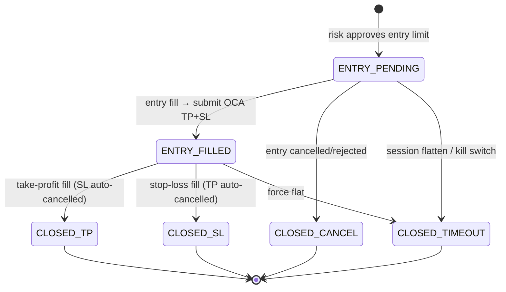

# Bracket Order State Machine

Every bracket trade is tracked as a `PositionGroup` with an explicit lifecycle.
This is standard quant infrastructure — safe to publish.

## States



| Status | Meaning |
|--------|---------|
| `ENTRY_PENDING` | Entry limit working; protective legs not yet placed |
| `ENTRY_FILLED` | In position; TP limit + SL stop active in OCA group |
| `CLOSED_TP` | Take-profit hit; sibling leg cancelled by OCA |
| `CLOSED_SL` | Stop-loss hit; sibling leg cancelled by OCA |
| `CLOSED_CANCEL` | Entry never filled (cancel/reject) |
| `CLOSED_TIMEOUT` | Force-closed at session end or risk halt |

## Code locations

| Module | Role |
|--------|------|
| `quant_demo/lifecycle.py` | `PositionGroupStatus` enum + `VALID_TRANSITIONS` + `assert_transition()` |
| `quant_demo/state.py` | `PositionGroup`, `OrderEntry`, `TradingState` |
| `quant_demo/runner/state_reducers.py` | Pure reducers: `apply_command`, `apply_bracket_commands`, `apply_fill`, `apply_done` |
| `quant_demo/execution/sim_broker.py` | Simulated OCA bracket fills |

## Design rules

1. **Transitions are validated** — illegal jumps raise `InvalidTransition`.
2. **Only risk emits orders** — strategy produces `StrategyIntent`, never `OrderCommand`.
3. **Broker wins on reconcile** — internal state is a projection; `AccountSnapshot` is authority.
4. **Idempotent fills** — `FillLeg.fill_id` deduplicates duplicate broker callbacks (live adapter).

## Order roles within a group

```
position_group_id (OCA group)
├── entry  (limit)
├── tp     (limit, opposite side)
└── sl     (stop, opposite side)
```

See `quant_demo.lifecycle.OrderRole`.
